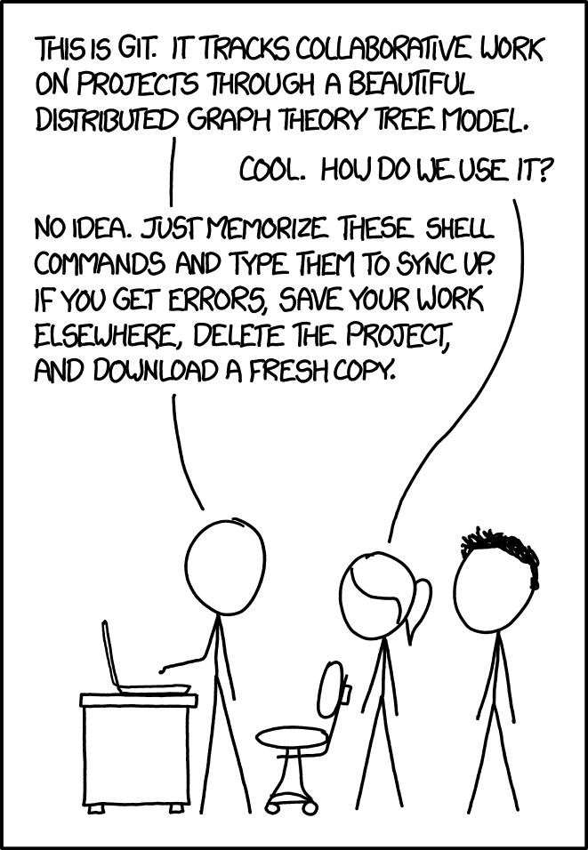

# Version Control

## How does Git work?
### The Three States:
1. Committed: snapshot/data is safely stored
2. Modified: changing the file, but not committed the database yet
3. Staged: you have marked a modified files in its current state to got to the next commit snapshit

That leads us the the three different components of a git project
* .git directory which is the repository of snapshots
* working directory which is a single checkout of one version of the project
* staging is where files with changes live until they are committed to the .git directory

.git Directory

The .git directory houses metadata (e.g., configs, info) and object database for your project. When you do a:
~~~
git clone
~~~
this gets copied from the remote source

#### Working Directory
The working directory contains files from the .git directory that have been placed on disk for use and modify and then also houses newly added files

#### Staging Area

Other content to add
* Creating a repo versus cloning
* Commit messages
* .gitignore
* Logs
* diffs

